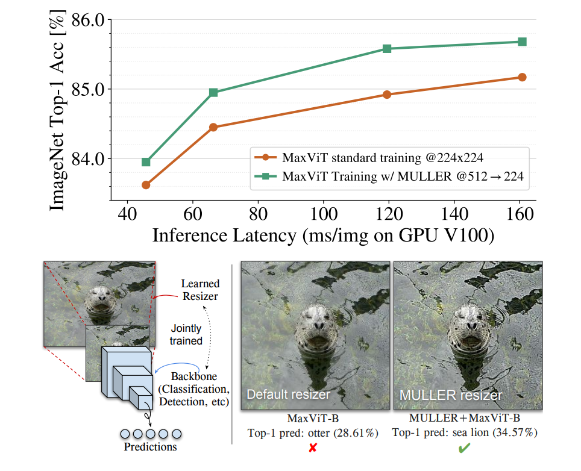

# Muller
This is my Pytorch implementation of the paper [MULLER: Multilayer Laplacian Resizer for Vision](https://arxiv.org/abs/2304.02859)

by Zhengzhong Tu, Peyman Milanfar, and Hossein Talebi

[The original Tensorflow implemtation repo is here](https://github.com/google-research/google-research/tree/master/muller)

[This is a sample of results(the image was taken from the original repo)](images/results.jpg)

## How to run?

Run the Jupyter Notebook and set the link to your image 
image_file = 'images/panda.jpg'

# TODO 

- release the trainable version
- add colab

## Citation

Should you find this repository useful, please consider citing:

        @article{tu2023muller,
        title={MULLER: Multilayer Laplacian Resizer for Vision},
        author={Tu, Zhengzhong and Milanfar, Peyman and Talebi, Hossein},
        journal={ICCV},
        year={2023}
        }